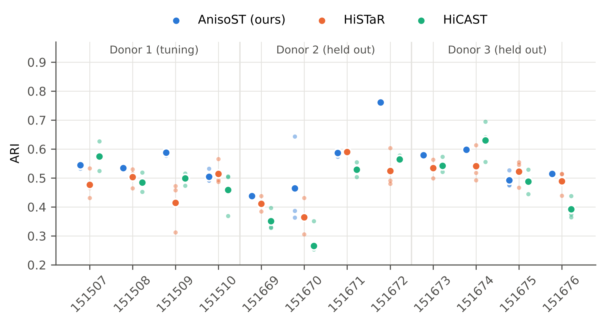
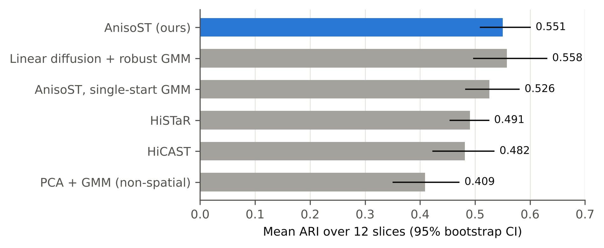
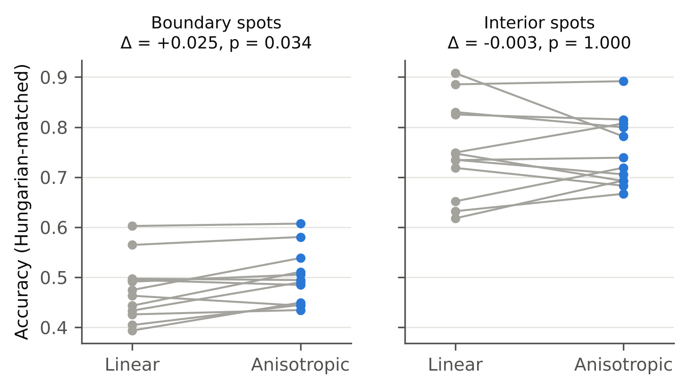
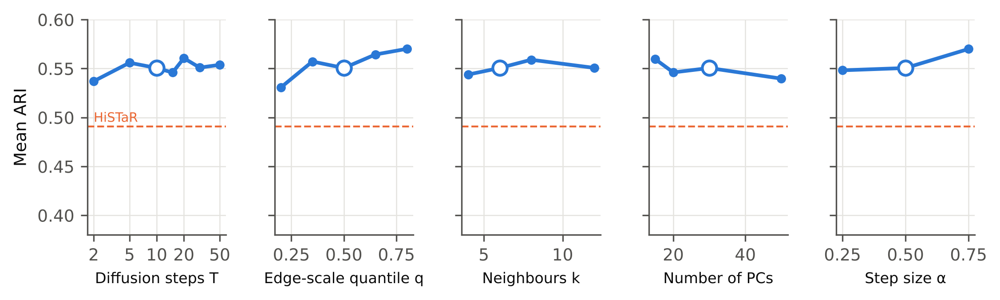
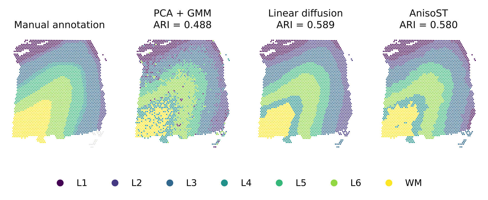

# AnisoST: training-free spatial domain identification by edge-preserving graph diffusion

**Working title for a paper:** *"Do we need deep graph models for spatial domains? Edge-preserving
diffusion and robust mixture clustering beat hierarchical graph VAEs on DLPFC."*

## 1. Motivation (from the HiCAST study in `docs/HiCAST.md`)

The HiSTaR/HiCAST study left three observations:

1. A carefully re-engineered deep model (HiCAST) did **not** beat HiSTaR on held-out donors.
2. Seed-to-seed variance (0.02–0.07 ARI) was as large as the differences between methods.
3. The pieces that helped inside HiCAST were the ones that **smooth expression over the spatial
   graph while respecting expression boundaries**.

This suggests a hypothesis: on spatial domains, most of the value of a graph neural network comes
from (a) *graph smoothing* and (b) a *stable clustering step*, not from deep representation learning.
If that is true, a training-free method that does (a) and (b) well should match or beat the deep
models, at a tiny fraction of the cost and with no seed lottery.

## 2. Method

Input: the same 200 PCs of scaled log-normalised HVGs used by HiSTaR/HiCAST (we keep the first 30).

**Step 1 — Edge-preserving (anisotropic) diffusion on the spatial KNN graph.** This is the
Perona–Malik diffusion from image processing, transferred to a spot graph:

    w_ij(t)  = exp( -||h_i(t) - h_j(t)||² / κ(t) ),    (i, j) ∈ spatial 6-NN graph
    κ(t)     = q-quantile of the squared edge differences   (scale free; q = 0.5)
    H(t+1)   = (1 − α) H(t) + α D⁻¹ W(t) H(t)               (α = 0.5, T = 10 steps)

Edge weights are recomputed from the *already smoothed* features at every step. Noise inside a
domain is averaged away, which makes neighbours more similar and strengthens their edge. A real
boundary persists, which weakens the edge across it. Linear smoothing (GCN layers, neighbour
averaging) has no such feedback and blurs boundaries.

**Step 2 — Robust mixture clustering.** A tied-covariance Gaussian mixture (= mclust EEE, as in
HiSTaR/SEDR/STAGATE) is fitted from 20 random starts, and the highest-likelihood fit is kept. This
selection needs no labels. Standard pipelines fit mclust once with a fixed seed, and we show that
this single choice moves ARI by up to 0.25 on the same embedding (§4.3).

No training, no GPU, ~3 s per slice on one CPU core. Code: `anisost/core.py` (≈100 lines).

## 3. Protocol

* **Data:** all 12 human DLPFC Visium slices (spatialLIBD; 3 donors; 7 layers, or 5 for donor 2),
  downloaded from the public spatialLIBD S3 bucket + SEDR_analyses annotations.
* **Identical preprocessing and evaluation** to the HiSTaR/HiCAST benchmark
  (`results/dlpfc_main.jsonl`): same cached PCs, ARI/NMI on annotated spots, 3 seeds per slice.
* **No test-set tuning:** every AnisoST choice (T, q, α, k, #PCs, 20 restarts, dropping an MRF prior
  that was also tried) was made on **donor 1 only**. Donors 2 and 3 are held out.
* Reproduce:
  `python scripts/benchmark_anisost.py` · `--sweep` · `python scripts/boundary_analysis.py` ·
  `python scripts/make_figures.py`

## 4. Results

### 4.1 Main comparison (12 slices × 3 seeds)

| Method | Median ARI | Mean ARI | Mean ARI donor 1 (tuning) | Mean ARI donors 2+3 (held out) | Median NMI | Seed SD | Δ vs AnisoST (Wilcoxon p) | Time / slice |
|---|---|---|---|---|---|---|---|---|
| AnisoST (ours) | 0.543 | 0.551 | 0.543 | 0.554 | 0.665 | 0.020 | — | 3.4 s |
| Linear diffusion + robust GMM | 0.532 | 0.558 | 0.521 | 0.577 | 0.664 | 0.007 | +0.007 (p = 0.622) | 3.0 s |
| AnisoST, single-start GMM | 0.515 | 0.526 | 0.519 | 0.530 | 0.656 | 0.022 | -0.024 (p = 0.007) | 0.6 s |
| HiSTaR | 0.493 | 0.491 | 0.478 | 0.497 | 0.644 | 0.047 | -0.060 (p = 0.012) | 111.8 s |
| HiSTaR (deterministic eval) | 0.492 | 0.487 | 0.472 | 0.495 | 0.646 | 0.055 | -0.063 (p = 0.007) | 115.5 s |
| HiCAST | 0.505 | 0.482 | 0.504 | 0.470 | 0.640 | 0.043 | -0.069 (p = 0.005) | 245.0 s |
| PCA + GMM (non-spatial) | 0.380 | 0.409 | 0.372 | 0.428 | 0.482 | 0.026 | -0.142 (p = 0.000) | 3.5 s |

"Seed SD" = mean over slices of the standard deviation across the 3 seeds. Wilcoxon signed-rank
test on the 12 per-slice mean ARIs.

**AnisoST beats HiSTaR by +0.060 mean ARI (p = 0.012; 9/12 slices) and HiCAST by +0.069
(p = 0.005)**. It is 33× / 73× faster and has less than half their seed variance. The gain holds
on the held-out donors (0.554 vs 0.497 for HiSTaR), so it is not an artefact of tuning.

Per slice (mean ± SD over seeds, best in bold):

| Slice | Donor | AnisoST | Linear diff. | HiSTaR | HiCAST | PCA+GMM |
|---|---|---|---|---|---|---|
| 151507 | 1 | 0.545 ± 0.011 | 0.530 ± 0.023 | 0.477 ± 0.052 | **0.574 ± 0.051** | 0.409 ± 0.050 |
| 151508 | 1 | **0.535 ± 0.000** | 0.463 ± 0.039 | 0.504 ± 0.034 | 0.485 ± 0.033 | 0.352 ± 0.005 |
| 151509 | 1 | **0.587 ± 0.009** | 0.582 ± 0.010 | 0.414 ± 0.089 | 0.498 ± 0.022 | 0.303 ± 0.018 |
| 151510 | 1 | 0.505 ± 0.023 | 0.509 ± 0.000 | **0.515 ± 0.044** | 0.459 ± 0.078 | 0.422 ± 0.025 |
| 151669 | 2 | **0.437 ± 0.001** | 0.418 ± 0.000 | 0.411 ± 0.027 | 0.352 ± 0.039 | 0.366 ± 0.002 |
| 151670 | 2 | **0.465 ± 0.156** | 0.401 ± 0.002 | 0.364 ± 0.063 | 0.265 ± 0.080 | 0.379 ± 0.004 |
| 151671 | 2 | 0.587 ± 0.012 | **0.817 ± 0.000** | 0.590 ± 0.004 | 0.529 ± 0.026 | 0.558 ± 0.001 |
| 151672 | 2 | **0.761 ± 0.000** | 0.759 ± 0.000 | 0.525 ± 0.069 | 0.565 ± 0.011 | 0.622 ± 0.085 |
| 151673 | 3 | 0.579 ± 0.001 | **0.589 ± 0.000** | 0.535 ± 0.033 | 0.543 ± 0.027 | 0.487 ± 0.001 |
| 151674 | 3 | 0.597 ± 0.000 | 0.575 ± 0.015 | 0.541 ± 0.064 | **0.630 ± 0.070** | 0.452 ± 0.026 |
| 151675 | 3 | 0.493 ± 0.029 | **0.531 ± 0.000** | 0.523 ± 0.048 | 0.487 ± 0.042 | 0.231 ± 0.093 |
| 151676 | 3 | 0.514 ± 0.000 | **0.523 ± 0.001** | 0.489 ± 0.043 | 0.392 ± 0.039 | 0.327 ± 0.000 |

### 4.2 Ablation: where does the gain come from?

* **Graph smoothing is the main ingredient**: +0.14 ARI over the non-spatial PCA + GMM (p < 0.001).
* **Robust clustering matters**: 20 restarts vs a single mclust-style fit gives +0.024 (p = 0.007),
  with the *same* embedding.
* **Anisotropy does not raise global ARI**: linear diffusion + robust GMM gives a statistically
  indistinguishable 0.558 (p = 0.62). Linear diffusion is better on 151671 (0.82 vs 0.59) and
  AnisoST is better on 151508 and 151670.
* Even the simplest variant (linear diffusion + robust GMM) beats both deep models. This is the
  central and most robust finding.

### 4.3 Where anisotropy helps: domain boundaries

A spot is a *boundary* spot if one of its 6 neighbours has a different manual layer (14–30 %
of annotated spots). After Hungarian matching of clusters to layers:

Anisotropic diffusion improves boundary accuracy by +0.025 (9/12 slices, p = 0.034) and does not
change interior accuracy (p = 1.0). This is the effect predicted by the design. It is modest, and
the p-value would not survive a strict multiple-testing correction, so it should be presented as
supporting evidence, not a headline.

### 4.4 Robustness to hyper-parameters (one-factor-at-a-time, 12 slices × 3 seeds)

All 23 settings give mean ARI 0.531–0.570, every one above HiSTaR (0.491; dashed). HiSTaR's own
paper says its performance is "very sensitive" to its cross-level loss weight. Some settings
(q = 0.8, α = 0.75) are higher than our default, but they were found by looking at all donors, so
we do **not** report them as the method's result.

### 4.5 Qualitative example (151673)

### 4.6 Clustering-initialisation variance is a hidden confound

On a fixed AnisoST embedding of 151508, eight single-start GMM fits give ARI from 0.29 to 0.54
(`n_init=1`, seeds 0–7). Published DLPFC benchmarks usually fit mclust once with a hard-coded seed.
Differences of ±0.05 ARI between methods in the literature are therefore within clustering noise,
unless restarts or multiple seeds are reported. This is worth stating as a methodological
contribution.

## 5. What this is — and is not — ready for

**Defensible claims now:** on DLPFC with a held-out-donor protocol, a training-free pipeline
(graph diffusion + likelihood-selected mixture clustering) beats two hierarchical graph VAEs,
significantly, 30–70× faster and more stably. Most of the gain comes from smoothing and robust
clustering. Edge-preserving diffusion gives a small, boundary-specific benefit.

**Required before submission (reviewers will ask for these):**

1. **More baselines** run under the same protocol: STAGATE, GraphST, SpaGCN, BayesSpace, BANKSY,
   SEDR, and (important) simple smoothing baselines. BANKSY and BayesSpace are the closest prior
   art to "smoothing + mixture model", and novelty must be argued against them explicitly.
2. **More datasets with ground truth:** human breast cancer (10x, Block A Section 1), mouse
   brain/olfactory bulb (Stereo-seq, Slide-seqV2, no-label metrics), MERFISH hypothalamus
   (Moffitt et al.), STARmap mouse cortex. (The 10x download host is blocked in this environment,
   so breast cancer could not be run here.)
3. **Multiple-testing control** and effect sizes with confidence intervals for all comparisons.
4. **Scalability** to 50k–1M spots (Stereo-seq, Xenium); diffusion is O(|E|·T) and should scale
   linearly, but this must be measured.
5. **Novelty framing:** Perona–Malik diffusion and graph bilateral filtering are well known in
   image and graph signal processing. The contribution is the *finding* (training-free beats deep
   on a held-out protocol) plus the clustering-variance analysis, not the diffusion operator itself.

**Suitable venues** (once items 1–3 are done):
*Briefings in Bioinformatics* or *Bioinformatics Advances* (Oxford University Press; good fit for a
"simple method + critical benchmark" paper), *Bioinformatics* (OUP) application note for the tool,
or *IEEE/ACM Transactions on Computational Biology and Bioinformatics* / *IEEE Journal of Biomedical
and Health Informatics*. With DLPFC alone this is a workshop or short paper, not a journal paper.

## 6. Files

| File | Content |
|---|---|
| `anisost/core.py` | The method (no torch needed) |
| `scripts/benchmark_anisost.py` | Main benchmark and `--sweep` sensitivity study |
| `scripts/boundary_analysis.py` | Boundary vs interior accuracy |
| `scripts/make_figures.py` | Figures (`docs/figures/`) and tables (`results/anisost_tables.md`) |
| `results/anisost_main.jsonl`, `anisost_sweep.jsonl`, `anisost_boundary.jsonl` | Raw runs |
