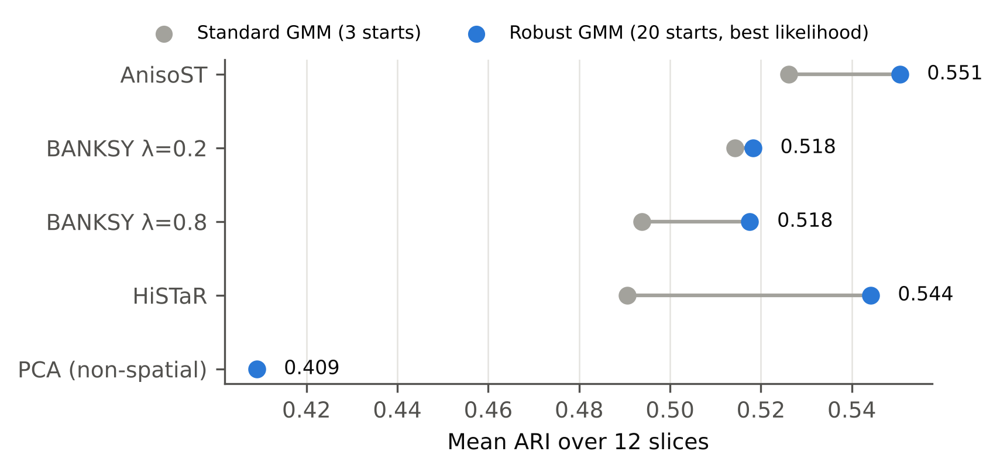

# AnisoST: training-free spatial domain identification, and what really drives DLPFC benchmarks

**Working title for a paper:** *"The clustering step, not the encoder: a clustering-matched
re-evaluation of spatial domain identification, with a training-free edge-preserving baseline."*

## Summary

* **AnisoST** (edge-preserving graph diffusion + a 20-start Gaussian mixture) needs no training,
  runs in ~3 s per slice on one CPU core, and reaches mean ARI **0.551** on the 12 DLPFC slices
  (3 seeds; settings fixed on donor 1 only).
* Compared with the other methods as they are usually run (one short mclust-style fit), AnisoST
  scores higher than HiSTaR (0.491, p = 0.012), HiCAST (0.482, p = 0.005), BANKSY (0.494–0.514)
  and SpaGCN (0.442, p = 0.001). That comparison is **not fair**, because AnisoST's clustering is
  better.
* **But when every method gets the same 20-start clustering, most of the gap closes.** HiSTaR
  rises from 0.491 to **0.544** (p = 0.47 vs AnisoST), and BANKSY rises to 0.518 (p = 0.34). Plain
  linear diffusion + robust clustering gets 0.558. Among the embedding methods tested, only SpaGCN
  stays significantly worse.
* **Main finding:** on DLPFC, a +0.05 ARI change from the clustering initialisation alone is as
  large as the differences that published papers attribute to new architectures. AnisoST's real
  advantages are cost (≈20–70× faster than the deep models), determinism and stability, plus a small
  gain at layer boundaries, not higher accuracy.

## 1. Motivation (from the HiCAST study in `docs/HiCAST.md`)

The HiSTaR/HiCAST study left three observations:

1. A carefully re-engineered deep model (HiCAST) did **not** beat HiSTaR on held-out donors.
2. Seed-to-seed variance (0.02–0.07 ARI) was as large as the differences between methods.
3. The pieces that helped inside HiCAST were the ones that **smooth expression over the spatial
   graph while respecting expression boundaries**.

Hypothesis: on spatial domains, most of the value of a graph neural network comes from (a) graph
smoothing and (b) the clustering step, not from deep representation learning. A training-free
method that does (a) and (b) well should then match the deep models at a fraction of the cost.

## 2. Method

Input: the same 200 PCs of scaled log-normalised HVGs used by HiSTaR/HiCAST (we keep the first 30).

**Step 1 — Edge-preserving (anisotropic) diffusion on the spatial KNN graph.** This is the
Perona–Malik diffusion from image processing, transferred to a spot graph:

    w_ij(t)  = exp( -||h_i(t) - h_j(t)||² / κ(t) ),    (i, j) ∈ spatial 6-NN graph
    κ(t)     = q-quantile of the squared edge differences   (scale free; q = 0.5)
    H(t+1)   = (1 − α) H(t) + α D⁻¹ W(t) H(t)               (α = 0.5, T = 10 steps)

Edge weights are recomputed from the *already smoothed* features at every step. Noise inside a
domain is averaged away, which makes neighbours more similar and strengthens their edge. A real
boundary persists, which weakens the edge across it. Linear smoothing (GCN layers, neighbour
averaging) has no such feedback and blurs boundaries.

**Step 2 — Robust mixture clustering.** A tied-covariance Gaussian mixture (= mclust EEE, as in
HiSTaR/SEDR/STAGATE) is fitted from 20 random starts, and the highest-likelihood fit is kept. This
selection needs no labels. Standard pipelines fit mclust once with a fixed seed, and we show that
this single choice moves ARI by up to 0.25 on the same embedding (§4.3).

No training, no GPU, ~3 s per slice on one CPU core. Code: `anisost/core.py` (≈100 lines).

## 3. Protocol

* **Data:** all 12 human DLPFC Visium slices (spatialLIBD; 3 donors; 7 layers, or 5 for donor 2),
  downloaded from the public spatialLIBD S3 bucket + SEDR_analyses annotations.
* **Identical preprocessing and evaluation** to the HiSTaR/HiCAST benchmark
  (`results/dlpfc_main.jsonl`): same cached PCs, ARI/NMI on annotated spots, 3 seeds per slice.
* **No test-set tuning:** every AnisoST choice (T, q, α, k, #PCs, 20 restarts, dropping an MRF prior
  that was also tried) was made on **donor 1 only**. Donors 2 and 3 are held out.
* **Extra baselines** (`scripts/benchmark_baselines.py`), run from the official packages on the
  same slices, seeds and metrics: **BANKSY** (pybanksy; k_geom = 18, max_m = 1, λ = 0.2 and 0.8,
  PCA 20, mclust-EEE GMM), **SpaGCN** (official tutorial pipeline without histology: p = 0.5,
  Louvain resolution search to the true number of domains, 200 epochs, hexagonal refinement), and
  **HiSTaR re-run** with both the standard and the 20-start GMM (re-run mean ARI 0.491 = original).
* **Clustering-matched comparison:** every embedding-based method is also clustered with the same
  20-start GMM (suffix "+ robust GMM"), so differences reflect the embedding, not the clustering.
* Reproduce:
  `python scripts/benchmark_anisost.py` · `--sweep` · `python scripts/benchmark_baselines.py` ·
  `python scripts/boundary_analysis.py` · `python scripts/make_figures.py`

## 4. Results

### 4.1 Main comparison (12 slices × 3 seeds)

| Method | Median ARI | Mean ARI | Mean ARI donor 1 (tuning) | Mean ARI donors 2+3 (held out) | Median NMI | Seed SD | Δ vs AnisoST (Wilcoxon p) | Time / slice |
|---|---|---|---|---|---|---|---|---|
| AnisoST (ours) | 0.543 | 0.551 | 0.543 | 0.554 | 0.665 | 0.020 | — | 3.4 s |
| Linear diffusion + robust GMM | 0.532 | 0.558 | 0.521 | 0.577 | 0.664 | 0.007 | +0.007 (p = 0.622) | 3.0 s |
| AnisoST, single-start GMM | 0.515 | 0.526 | 0.519 | 0.530 | 0.656 | 0.022 | -0.024 (p = 0.007) | 0.6 s |
| BANKSY λ=0.2 + robust GMM | 0.527 | 0.518 | 0.512 | 0.522 | 0.628 | 0.040 | -0.032 (p = 0.339) | 5.4 s |
| BANKSY λ=0.2 | 0.505 | 0.514 | 0.509 | 0.517 | 0.632 | 0.056 | -0.036 (p = 0.176) | 5.4 s |
| BANKSY λ=0.8 + robust GMM | 0.537 | 0.518 | 0.491 | 0.531 | 0.619 | 0.046 | -0.033 (p = 0.339) | 5.4 s |
| BANKSY λ=0.8 | 0.487 | 0.494 | 0.456 | 0.513 | 0.612 | 0.067 | -0.057 (p = 0.034) | 5.4 s |
| HiSTaR + robust GMM | 0.518 | 0.544 | 0.493 | 0.569 | 0.659 | 0.067 | -0.006 (p = 0.470) | 64.9 s |
| SpaGCN (refined) | 0.453 | 0.442 | 0.439 | 0.443 | 0.584 | 0.040 | -0.109 (p = 0.001) | 41.9 s |
| SpaGCN | 0.430 | 0.422 | 0.418 | 0.424 | 0.556 | 0.038 | -0.129 (p = 0.001) | 41.9 s |
| HiSTaR | 0.493 | 0.491 | 0.478 | 0.497 | 0.644 | 0.047 | -0.060 (p = 0.012) | 111.8 s |
| HiSTaR (deterministic eval) | 0.492 | 0.487 | 0.472 | 0.495 | 0.646 | 0.055 | -0.063 (p = 0.007) | 115.5 s |
| HiCAST | 0.505 | 0.482 | 0.504 | 0.470 | 0.640 | 0.043 | -0.069 (p = 0.005) | 245.0 s |
| PCA + GMM (non-spatial) | 0.380 | 0.409 | 0.372 | 0.428 | 0.482 | 0.026 | -0.142 (p = 0.000) | 3.5 s |

"Seed SD" = mean over slices of the standard deviation across the 3 seeds. Wilcoxon signed-rank
test on the 12 per-slice mean ARIs (no multiple-testing correction). Times are single-thread CPU.

Per slice (mean ± SD over seeds, best in bold):

| Slice | Donor | AnisoST (ours) | Linear diffusion + robust GMM | HiSTaR | HiCAST | PCA + GMM (non-spatial) | BANKSY λ=0.2 + robust GMM | SpaGCN (refined) |
|---|---|---|---|---|---|---|---|---|
| 151507 | 1 | 0.545 ± 0.011 | 0.530 ± 0.023 | 0.477 ± 0.052 | **0.574 ± 0.051** | 0.409 ± 0.050 | 0.490 ± 0.004 | 0.472 ± 0.016 |
| 151508 | 1 | **0.535 ± 0.000** | 0.463 ± 0.039 | 0.504 ± 0.034 | 0.485 ± 0.033 | 0.352 ± 0.005 | 0.510 ± 0.011 | 0.413 ± 0.017 |
| 151509 | 1 | **0.587 ± 0.009** | 0.582 ± 0.010 | 0.414 ± 0.089 | 0.498 ± 0.022 | 0.303 ± 0.018 | 0.505 ± 0.073 | 0.453 ± 0.022 |
| 151510 | 1 | 0.505 ± 0.023 | 0.509 ± 0.000 | 0.515 ± 0.044 | 0.459 ± 0.078 | 0.422 ± 0.025 | **0.541 ± 0.010** | 0.419 ± 0.032 |
| 151669 | 2 | 0.437 ± 0.001 | 0.418 ± 0.000 | 0.411 ± 0.027 | 0.352 ± 0.039 | 0.366 ± 0.002 | **0.553 ± 0.086** | 0.319 ± 0.056 |
| 151670 | 2 | 0.465 ± 0.156 | 0.401 ± 0.002 | 0.364 ± 0.063 | 0.265 ± 0.080 | 0.379 ± 0.004 | **0.518 ± 0.130** | 0.250 ± 0.067 |
| 151671 | 2 | 0.587 ± 0.012 | **0.817 ± 0.000** | 0.590 ± 0.004 | 0.529 ± 0.026 | 0.558 ± 0.001 | 0.761 ± 0.004 | 0.524 ± 0.039 |
| 151672 | 2 | **0.761 ± 0.000** | 0.759 ± 0.000 | 0.525 ± 0.069 | 0.565 ± 0.011 | 0.622 ± 0.085 | 0.585 ± 0.002 | 0.581 ± 0.008 |
| 151673 | 3 | 0.579 ± 0.001 | **0.589 ± 0.000** | 0.535 ± 0.033 | 0.543 ± 0.027 | 0.487 ± 0.001 | 0.572 ± 0.043 | 0.471 ± 0.079 |
| 151674 | 3 | 0.597 ± 0.000 | 0.575 ± 0.015 | 0.541 ± 0.064 | **0.630 ± 0.070** | 0.452 ± 0.026 | 0.491 ± 0.086 | 0.442 ± 0.024 |
| 151675 | 3 | 0.493 ± 0.029 | **0.531 ± 0.000** | 0.523 ± 0.048 | 0.487 ± 0.042 | 0.231 ± 0.093 | 0.258 ± 0.026 | 0.520 ± 0.009 |
| 151676 | 3 | 0.514 ± 0.000 | **0.523 ± 0.001** | 0.489 ± 0.043 | 0.392 ± 0.039 | 0.327 ± 0.000 | 0.436 ± 0.002 | 0.437 ± 0.111 |

### 4.2 Clustering-matched comparison: the key control

| Comparison (mean ARI, 12 slices) | Standard GMM | 20-start GMM | Gain from clustering alone |
|---|---|---|---|
| HiSTaR | 0.491 | 0.544 | **+0.053** |
| BANKSY λ = 0.8 | 0.494 | 0.518 | +0.024 |
| BANKSY λ = 0.2 | 0.514 | 0.518 | +0.004 |
| AnisoST | 0.526 | 0.551 | +0.024 |

* With matched clustering, AnisoST vs HiSTaR is **+0.006 (p = 0.47)**; vs BANKSY +0.03 (p = 0.34);
  vs linear diffusion −0.007 (p = 0.62). **None of these differences is significant.**
* HiSTaR's embedding benefits most from better clustering. The GMM on its 3×-concatenated latent
  space has many local optima, so a single short fit often lands in a poor one.
* With robust clustering, HiSTaR's remaining variance comes from *training* (seed SD 0.067 vs 0.020
  for AnisoST): it is about as accurate on average but less reproducible, and ~20× slower.
* SpaGCN remains clearly worse (0.442 refined; p = 0.001) under its own tutorial pipeline.

**Interpretation.** The earlier headline "AnisoST beats HiSTaR by +0.06" was mostly a clustering
effect. The defensible claims are: (i) a ~100-line training-free method is **as accurate as** a
hierarchical graph VAE once clustering is matched, (ii) it is far cheaper and more stable, and
(iii) single-fit mclust, the default in HiSTaR, SEDR, STAGATE and related tools, can hide or
create differences of ±0.05 ARI.

### 4.3 Ablation within AnisoST

* Graph smoothing: +0.14 ARI over non-spatial PCA + GMM (p < 0.001).
* Robust clustering: +0.024 on the same embedding (p = 0.007).
* Anisotropy: no gain in global ARI (linear diffusion 0.558, p = 0.62), but see §4.4.

### 4.4 Where anisotropy helps: domain boundaries

A spot is a *boundary* spot if one of its 6 neighbours has a different manual layer (14–30 %
of annotated spots). After Hungarian matching of clusters to layers:

Anisotropic diffusion improves boundary accuracy by +0.025 (9/12 slices, p = 0.034) and does not
change interior accuracy (p = 1.0). This is the effect predicted by the design. It is modest, and
the p-value would not survive a strict multiple-testing correction, so it should be presented as
supporting evidence, not a headline.

### 4.5 Robustness to hyper-parameters (one-factor-at-a-time, 12 slices × 3 seeds)

All 23 settings give mean ARI 0.531–0.570, every one above HiSTaR (0.491; dashed). HiSTaR's own
paper says its performance is "very sensitive" to its cross-level loss weight. Some settings
(q = 0.8, α = 0.75) are higher than our default, but they were found by looking at all donors, so
we do **not** report them as the method's result.

### 4.6 Qualitative example (151673)

### 4.7 How large is clustering noise on a fixed embedding?

On a fixed AnisoST embedding of 151508, eight single-start GMM fits give ARI from 0.29 to 0.54
(`n_init=1`, seeds 0–7). Published DLPFC benchmarks usually fit mclust once with a hard-coded seed.
Differences of ±0.05 ARI between methods in the literature are therefore within clustering noise,
unless restarts or multiple seeds are reported. This is worth stating as a methodological
contribution.

## 5. What this is — and is not — ready for

**Defensible claims now (DLPFC, held-out-donor protocol, 7 methods, clustering-matched):**

1. Clustering initialisation is a first-order confound: it moves HiSTaR by +0.053 mean ARI, more than
   the gap between most published methods.
2. Under matched clustering, training-free graph diffusion (AnisoST or plain linear diffusion)
   matches HiSTaR and BANKSY and beats SpaGCN, 20–70× faster and with ~3× lower seed variance than
   HiSTaR.
3. Edge-preserving diffusion gives a small, boundary-specific accuracy gain (+2.5 points, p = 0.034).

**Not supported:** that AnisoST is *more accurate* than HiSTaR or BANKSY.

**Recommended framing:** a *critical-assessment / benchmarking* paper ("the clustering step, not the
encoder"), with AnisoST as the lightweight reference baseline. This does not depend on AnisoST
winning; it depends on the clustering-matched protocol, which is what reviewers will find new.

**Still required before submission:**

1. **Apply the clustering-matched protocol to more encoders:** STAGATE, GraphST, SEDR, DeepST,
   BayesSpace (has its own spatial clustering; compare as is). The claim "clustering, not encoder"
   needs 5+ deep encoders to be convincing.
2. **More datasets with ground truth:** human breast cancer (10x), MERFISH hypothalamus, STARmap,
   mouse brain/olfactory bulb (Stereo-seq, Slide-seqV2). (The 10x download host is blocked in this
   environment.)
3. **Multiple-testing control** and confidence intervals for all comparisons, plus a quantitative
   analysis of how the clustering gain depends on embedding dimension and geometry.
4. **Scalability** to 50k–1M spots.

**Suitable venues** (once items 1–2 are done): *Briefings in Bioinformatics* (OUP; benchmarking and
critical-assessment papers are a core article type), *Bioinformatics Advances* (OUP), or
*IEEE/ACM Transactions on Computational Biology and Bioinformatics*. With DLPFC alone this is a
workshop or short paper.

## 6. Files

| File | Content |
|---|---|
| `anisost/core.py` | The method (no torch needed) |
| `scripts/benchmark_anisost.py` | AnisoST, ablations and `--sweep` sensitivity study |
| `scripts/benchmark_baselines.py` | BANKSY, SpaGCN, HiSTaR re-run, clustering-matched variants |
| `scripts/boundary_analysis.py` | Boundary vs interior accuracy |
| `scripts/make_figures.py` | Figures (`docs/figures/`) and tables (`results/anisost_tables.md`) |
| `results/anisost_main.jsonl`, `anisost_sweep.jsonl`, `anisost_boundary.jsonl`, `baselines.jsonl` | Raw runs |
